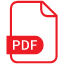

Don't forget to hit the :star: if you like this repo.

# ULRS1012: NILAI DAN JATI DIRI (VALUE AND IDENTITY)

## Maklumat Kursus
Kursus ini mengetengahkan teras utama UTM yang menjadi penggerak kepada modal insan yang kreatif dan inovatif untuk memenuhi keperluan negara pada masa hadapan. Teras utama tersebut adalah Integriti, Sinergi, Kecemerlangan dan Kelestarian (ISES – Integrity, Synergy, Excellence and Sustainability). Konsep asas yang mendasari kursus ini adalah nilai integriti, nilai dan jati diri yang dapat membendung segala bentuk salah guna kuasa dalam kehidupan seharian serta dalam organisasi seperti rasuah; dan langkah-langkah pencegahan rasuah.

Kursus ini juga menekankan kepentingan sistem nilai dan etika, yang merangkumi aspek hubungan antara manusia dan menguruskan /menghargai kepelbagaian. Di samping itu, kursus ini juga menekankan penyelesaian holistik terhadap isu-isu semasa, transformasi dan inovasi, falsafah sains dan teknologi yang berteraskan kepada nilai, integriti dan jati diri ke arah mencapai matlamat menghasilkan siswazah yang cemerlang dari segi jasmani, emosi, rohani dan intelek. Usaha ini selari dengan komitmen negara dalam melaksanakan Agenda Pembangunan Mampan (SDG) menjelang 2030 menerusi agenda Wawasan Kemakmuran Bersama 2030 dengan menyediakan taraf hidup yang baik untuk semua warganegara menjelang 2030.

## Tugasan

### Integriti dan Rasuah

| Kumpulan | Tajuk | Poster | Laporan |
| :-----: | ----- | :------: | :------: | 
| 1 | Kes rasuah projek solar di Sarawak |  |  |
| 2 | Rasuah dalam kalangan masyarakat|  |  |
| 3 | Bekas YDP dituduh kes rasuah luluskan projek di Selangor |  |  |
| 4 | Pengurus hartanah dan isterinya didakwa terlibat dalam rasuah dan pengubahan wang haram |  |  |
| 5 | Cikgu memandu terima RM 400 |  |  |
| 6 | Isu pegawai & anggota polis marin tidak mengaku rasuah & peras ugut |  |  |
| 7 | Pemalsuan dokumen |  |  |
| 8 | Skandal 1Malaysia Development Berhad |  |  |
| 9 | Rasuah: Pensyarah tambah markah matematik |  |  |
| 10 | Katakan tidak pada rasuah |  |  |
| 11 | Rasuah: TNC UTHM disabitkan terlibat dengan rasuah |  |  |

### Analisis SWOT
- Lakukan analisis SWOT dan bincangkan strategi untuk menyelesaikan kajian kes pilihan 
- Pelajar perlu memahami dan membincangkan secara kritikal dan lengkap tentang senario yang dibincangkan melalui setiap elemen SWOT. Pelajar perlu mencadangkan strategi yang sangat relevan dan berdasarkan penilaiaan yang analitik yang intensif.

### Penghasilan Video : Public Survice Announcement 
Setiap kumpulan dikehendaki menghasilkan satu video pendek dengan kriteria berikut: 
1. Durasi 1 sehingga 2 minit sahaja 
2. Pelajar bebas menggunakan apa-apa sumber digital untuk menghasilkan video. 
3. Bentuk persembahan video adalah bebas: 
    - Boleh menggunakan powtoon atau apa-apa bentuk animasi. 
    - Ahli kumpulan boleh berlakon 
    - Atau apa-apa bentuk yang boleh menyampaikan maklumat yang telah dipelajari dari topik minggu 1 hingga minggu 14 
5. Setiap video di upload ke youtube dan dihantar dalam bentuk link sahaja 
6. Syarat penghasilan video: 
    - Mengikut kreativiti masing-masing 
    - Menutup aurat 
    - Tiada gambar yang menjolok mata 
    - Latar muzik/latar suara yang bersesuaian 
    - 1 hingga 2 minit sahaja 
    - Masukkan disclaimer pada video (Video ini adalah bertujuan untuk tugasan kursus Nilai dan Jati Diri sahaja)

#### 🌟 Video
| Kumpulan | Tajuk | Video |
| :-----: | ----- | :------: | 
| 1 | Apa itu rasuah? |  |
| 2 | Rasuah Perosak Bangsa & Negara |  |
| 3 | Rasuah atau Maruah? |  |
| 4 | Rasuah:Kejayaan tiada jalan singkat |  |
| 5 | Rasuah dihina, maruah dibina |  |
| 6 | Rasuah membawa padah |  |
| 7 | Rasuah membawa padah |  |
| 8 | Perangi Rasuah |  |
| 9 | Perbualan Antara 4 Pelajar Tentang Rasuah |  |

### Debat

**Persediaan**
- Pastikan kumpulan anda ditugaskan di pihak mana.
- Cari sebarang maklumat berkenaan topik anda dan pastikan maklumat anda berkaitan dengan skop topik tersebut.
- Pilih hanya maklumat yang mempunyai kesahan/otoriti untuk menyokong hujah anda
- Matlamat peserta debat adalah untuk membuat hujah yangmeyakinkan dengan cara yang sopan.

**Prosedur**
- Wakil kumpulan yang membawa agenda kerajaan akan memulakan hujah pembukaan.
- Wakil kumpulan yang membawa agenda pembangkang pula akan memulakan hujah pembukaan.
- Ahli kumpulan yang lain perlu menyediakan hujah jawapan balas (counter argument) kepada hujah pembukaan pihak
lawan. 

#### 🌟 Video

| Kumpulan | Tajuk | Video |
| :-----: | ----- | :------: | 
| 1 | Debat bidaan melibatkan ahli keluarga |  |
| 2 | Penilaian kumpulan |  |
| 3 | Kemerosotan sifat bahan |  |
| 4 | Bahan kimia & toksik |  |
| 5 | 'Bad Unit' perlu diperbaiki |  |
| 6 | Sel kanser |  |
| 7 | Kepentingan rakyat atau negara? |  |
| 8 | Penilaian kumpulan  |  |
| 9 | Penilaian kumpulan |  |

## Contribution 🛠️
Please create an [Issue](https://github.com/drshahizan/courses/issues) for any improvements, suggestions or errors in the content.

You can also contact me using [Linkedin](https://www.linkedin.com/in/drshahizan/) for any other queries or feedback.

